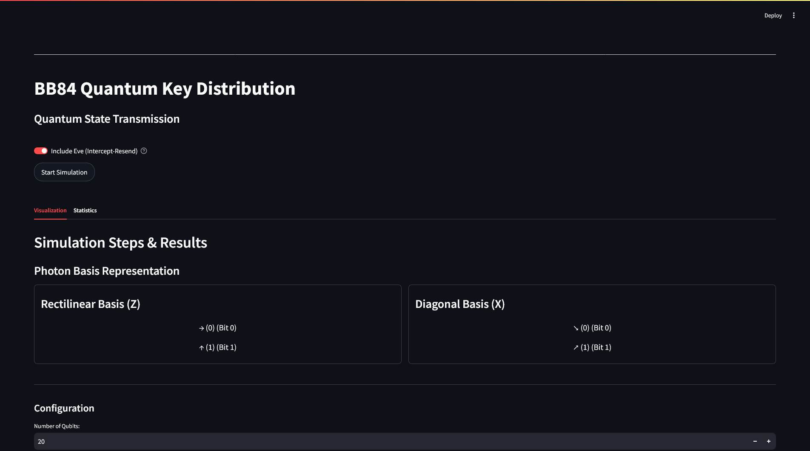

# Quantum Key Distribution (QKD) Simulator

An interactive web application that simulates Quantum Key Distribution protocols using Qiskit and Streamlit. This tool allows users to visualize and understand the fundamental principles of quantum cryptography.



## Overview

This simulator primarily demonstrates the BB84 protocol, the first quantum cryptographic protocol developed by Bennett and Brassard in 1984, with additional support for the E91 protocol. It allows users to:

- Generate and exchange quantum keys between two parties (Alice and Bob)
- Simulate an eavesdropper (Eve) using intercept-resend attacks
- Run simulations on a local Qiskit simulator or real IBM Quantum hardware
- Visualize each step of the protocol with interactive tables and statistics
- Calculate and analyze Quantum Bit Error Rates (QBER)
- Apply error correction and privacy amplification techniques

## Features

- **Protocol Implementations**: 
  - BB84 protocol (Bennett and Brassard, 1984)
  - E91 protocol (Ekert, 1991)
- **Interactive UI**: User-friendly Streamlit interface with tabbed visualization and statistics views
- **Quantum Backend Options**: 
  - Local simulator using Qiskit Aer
  - IBM Quantum real hardware integration
  - Customizable noise models for realistic simulations
- **Eavesdropping Simulation**: 
  - Eve's intercept-resend attack modeling
  - Theoretical QBER calculation with eavesdropper presence
- **Post-processing**: 
  - Key sifting
  - Error estimation
  - Error correction
  - Privacy amplification
- **Performance Metrics**: 
  - QBER calculation
  - Protocol efficiency statistics
  - Bit error rate analysis
- **Educational Value**: 
  - Step-by-step visualization of quantum states and measurements
  - Circuit visualization capabilities

## Installation

### Prerequisites

- Python 3.8 or higher
- pip package manager

### Basic Installation

1. Clone the repository:
   ```bash
   git clone https://github.com/yourusername/qkd_sim_py.git
   cd qkd_sim_py
   ```

2. Create a virtual environment:
   ```bash
   python -m venv venv
   ```

3. Activate the virtual environment:
   - On Windows:
     ```bash
     venv\Scripts\activate
     ```
   - On macOS/Linux:
     ```bash
     source venv/bin/activate
     ```

4. Install dependencies:
   ```bash
   pip install -r requirements.txt
   ```

### IBM Quantum Integration (Optional)

To use IBM Quantum backends:

1. Create an IBM Quantum account at [quantum-computing.ibm.com](https://quantum-computing.ibm.com/)
2. Get your API token from the IBM Quantum dashboard
3. Create a `.streamlit/secrets.toml` file with your token:
   ```toml
   IBM_QUANTUM_TOKEN = "your_token_here"
   ```

> **Note**: Never commit your `.streamlit/secrets.toml` file to version control.

## Running the Application

### Local Development

Start the Streamlit application:

```bash
streamlit run app.py
```

The application will be available at `http://localhost:8501` in your web browser.

### Docker Deployment (Optional)

1. Build the Docker image:
   ```bash
   docker build -t qkd-simulator .
   ```

2. Run the container:
   ```bash
   docker run -p 8501:8501 qkd-simulator
   ```

## Usage Guide

### Basic Simulation

1. Select the number of qubits to use in the simulation
2. Choose a backend (local simulator or IBM Quantum hardware)
3. Toggle "Include Eve" to simulate an eavesdropper
4. Click "Start Simulation" to run the protocol
5. View the results in the Visualization and Statistics tabs

### Advanced Features

#### Custom Noise Models

The simulator supports custom noise models to simulate realistic quantum environments:

```python
from qkd_simulation.quantum.runner import create_noise_model, run_circuits_local_simulator

# Create a custom noise model
noise_model = create_noise_model({
    'readout': 0.02,  # 2% readout error
    'gate1': 0.005,   # 0.5% single-qubit gate error
    'gate2': 0.02     # 2% two-qubit gate error
})

# Run simulation with the noise model
results = run_circuits_local_simulator(circuits, noise_model=noise_model)
```

#### Batch Processing

For large simulations, use batch processing to improve performance:

```python
from qkd_simulation.quantum.runner import run_circuits_batch

# Run 1000 circuits in batches of 50
results = run_circuits_batch(circuits, batch_size=50)
```

#### Error Correction and Privacy Amplification

Apply post-processing techniques to the sifted key:

```python
from qkd_simulation.classical.processing import apply_error_correction, privacy_amplification

# Apply error correction
corrected_key, error_rate = apply_error_correction(alice_key, bob_key)

# Apply privacy amplification
final_key = privacy_amplification(corrected_key, security_parameter=0.8)
```

## Project Structure

```
qkd_sim_py/
├── app.py                      # Main Streamlit application
├── requirements.txt            # Python dependencies
├── images/                     # Images for UI and documentation
└── qkd_simulation/             # Core simulation package
    ├── __init__.py
    ├── protocols/              # QKD protocol implementations
    │   ├── __init__.py
    │   └── bb84.py             # BB84 protocol implementation
    ├── quantum/                # Quantum simulation components
    │   ├── __init__.py
    │   ├── circuits.py         # Quantum circuit creation
    │   └── runner.py           # Circuit execution on simulators/hardware
    ├── classical/              # Classical post-processing
    │   ├── __init__.py
    │   └── processing.py       # Key sifting, error correction, etc.
    └── utils/                  # Utility functions
        ├── __init__.py
        └── helpers.py          # Helper functions
```

## Contributing

Contributions are welcome! Please follow these steps:

1. Fork the repository
2. Create a feature branch: `git checkout -b feature-name`
3. Commit your changes: `git commit -m 'Add some feature'`
4. Push to the branch: `git push origin feature-name`
5. Submit a pull request

## License

This project is licensed under the MIT License - see the LICENSE file for details.

## Acknowledgments

- IBM Quantum for providing access to quantum hardware
- Qiskit team for the quantum computing framework
- Streamlit for the interactive web application framework
